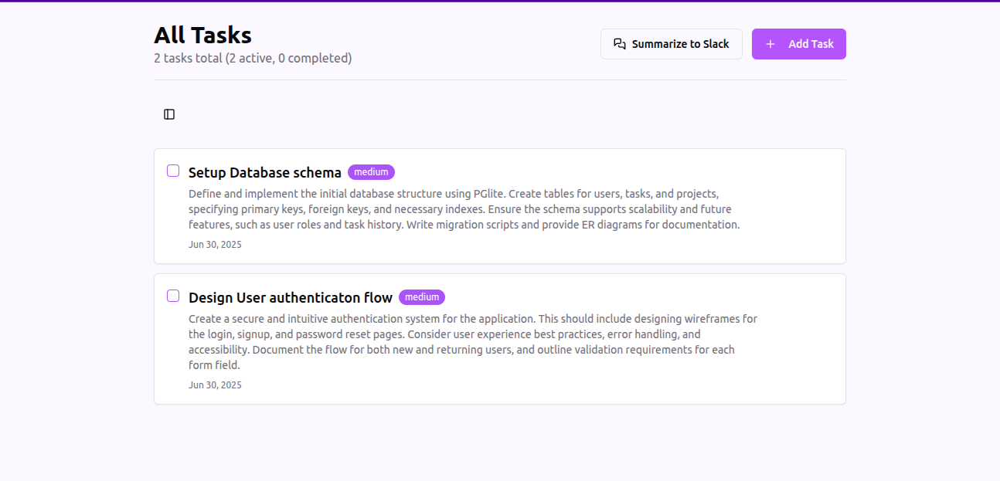

# DailyZen

**Live Application:** [https://daily-zen-sigma.vercel.app/](https://daily-zen-sigma.vercel.app/)

A simple and calming to-do application designed to help you manage your tasks with a touch of zen. Built with React, Vite, TypeScript, Tailwind CSS, shadcn/ui, and Supabase.

<p align="center">
  
  
  
  
  
  
  
</p>

## 🎥 Demo

Click on the screenshot to see the GIF in action.

[](./assets/dailyzen_demo.gif)

## 📜 Table of Contents
- [DailyZen](#dailyzen)
  - [🎥 Demo](#-demo)
  - [📜 Table of Contents](#-table-of-contents)
  - [Features](#features)
  - [Tech Stack](#tech-stack)
  - [Prerequisites](#prerequisites)
  - [Getting Started / Local Setup](#getting-started--local-setup)
  - [Supabase Setup](#supabase-setup)
  - [Deployment to Vercel](#deployment-to-vercel)
  - [Design and Architecture Decisions](#design-and-architecture-decisions)
  - [Slack and LLM Integration](#slack-and-llm-integration)
  - [Contributing](#contributing)
  - [License](#license)

## Features
*   🔑 User authentication (Sign up, Sign in, Sign out)
*   📝 Create, Read, Update, Delete (CRUD) for tasks
*   ✅ Task completion status
*   👤 User profile page
*   ✨ Clean, minimalist UI focused on productivity and calm
*   📱💻 Responsive design with a fixed sidebar on larger screens
*   🔔 Toast notifications for user actions

## Tech Stack

*   **Frontend:** ⚛️ React, ⚡️ Vite, 🔷 TypeScript
*   **Routing:** 🔗 React Router
*   **Data Fetching/Caching:** 🔄 TanStack Query (React Query)
*   **Styling:** 🌬️ Tailwind CSS
*   **UI Components:** 🧩 [shadcn/ui](https://ui.shadcn.com/) (Toaster, Tooltip, Sonner, etc.)
*   **Backend & Database:** 🔥 [Supabase](https://supabase.com/) (Authentication, PostgreSQL, Edge Functions)
*   **Deployment:** ▲ [Vercel](https://vercel.com/)

## Prerequisites

*   🟢 Node.js (v18.x or later recommended)
*   📦 npm, yarn, or pnpm
*   🔥 A Supabase account (free tier is sufficient to get started)
*   ▲ A Vercel account (for deployment)

## Getting Started / Local Setup

Follow these instructions to get the project running on your local machine.

1.  **Clone the repository:**
    ```bash
    git clone git@github.com:RoystonDAlmeida/DailyZen.git
    cd DailyZen/
    ```

2.  **Install dependencies:**
    Choose your preferred package manager:
    ```bash
    npm install
    # or
    yarn install
    # or
    pnpm install
    ```

3.  **Set up environment variables:**
    Copy the example environment file and update it with your Supabase credentials:
    ```bash
    cp .env.example .env
    ```
    Open the newly created `.env` file and fill in your details:
    ```env
    VITE_SUPABASE_URL="your_supabase_project_url"
    VITE_SUPABASE_ANON_KEY="your_supabase_anon_key"
    ```
    You can find these values in your Supabase project dashboard under **Project Settings > API**.

4.  **Run the development server:**
    ```bash
    npm run dev
    # or
    yarn dev
    # or
    pnpm dev
    ```
    The application should now be running, typically at `http://localhost:8080`.

5.  **Build for production:**
    To create an optimized production build:
    ```bash
    npm run build
    # or
    yarn build
    # or
    pnpm build
    ```
    This command generates static assets in the `dist/` directory.

## Supabase Setup

*   If you haven't already, create a new project on Supabase.
*   Navigate to your project's dashboard.
*   Go to **Project Settings** (the gear icon in the left sidebar).
*   Under the **API** 🔑 section, you'll find your **Project URL** (for `VITE_SUPABASE_URL`) and the **anon public key** (for `VITE_SUPABASE_ANON_KEY`).
*   **📊 Database Schema:**
    *   You'll need a `todos` table. A basic schema might include:
        *   `id` (uuid, primary key, default: `uuid_generate_v4()`)
        *   `user_id` (uuid, foreign key to `auth.users.id`, default: `auth.uid()`)
        *   `title` (text, not null)
        *   `description` (Optional - text, not null)
        *   `is_completed` (boolean, default: `false`)
        *   `priority` (text, default:`low`))
        *   `created_at` (timestamp with time zone, default: `now()`)
        *   `updated_at` (timestamp with time zone, default: `now()`)
    *   A `profiles` table is used to store additional user-specific information:
        *   `id` (uuid, primary key, foreign key to `auth.users.id`)
        *   `created_at` (timestamp with time zone, default: `now()`)
        *   `slack_webhook_url` (text, Default - NULL) - Stores the user's Slack webhook URL for potential notifications.

*   **🛡️ Row Level Security (RLS):**
    *   It is **CRITICAL** to enable RLS on your tables (especially `todos` and `profiles`).
    *   Define policies to ensure users can only access and modify their own data.
    *   Example RLS policy for `todos` table (select own todos):
        ```sql
        CREATE POLICY "Enable read access for authenticated users on their own todos"
        ON public.todos FOR SELECT
        USING (auth.uid() = user_id);
        ```
        (Similar policies will be needed for INSERT, UPDATE, DELETE).
*   **Authentication:**
    *   Configure authentication providers (Email) under the **Authentication > Providers** section in your Supabase dashboard.
    *   Ensure email templates are configured if using email-based auth.

## Deployment to Vercel

1.  Push your code to a Git repository.
2.  Log in to your Vercel dashboard and click "Add New..." > "Project".
3.  Import your Git repository.
4.  Vercel should auto-detect it as a Vite project. Confirm the build settings (Build command: `npm run build` or `vite build`, Output Directory: `dist`).
5.  **Environment Variables:** In your Vercel project settings (Settings > Environment Variables), add:
    *   `VITE_SUPABASE_URL` (with your Supabase project URL)
    *   `VITE_SUPABASE_ANON_KEY` (with your Supabase anon key)
6.  **Supabase Auth URL Configuration:**
    *   In your Supabase project dashboard, go to **Authentication > URL Configuration**.
    *   Set the **Site URL** to your Vercel deployment URL (e.g., `https://your-daily-zen-todos.vercel.app`).
    *   Add your Vercel URL and local development URL (`http://localhost:5173` or your dev port) to the **Redirect URLs** list.
7.  Click "Deploy". Vercel will build and deploy your application. Your live URL will be provided upon successful deployment.

## Design and Architecture Decisions

*   **Frontend Framework (React with Vite & TypeScript):**
    *   **React:** Chosen for its component-based architecture, declarative UI, and extensive ecosystem, making it ideal for building interactive user interfaces.
    *   **Vite:** Selected for its extremely fast development server (leveraging native ES modules) and optimized build process, significantly improving developer experience.
    *   **TypeScript:** Integrated to add static typing, which enhances code quality, reduces runtime errors, improves maintainability, and provides better autocompletion and refactoring capabilities.

*   **UI (Tailwind CSS + shadcn/ui):**
    *   **Tailwind CSS:** A utility-first CSS framework that allows for rapid UI development directly within the HTML markup. It promotes consistency and customizability without writing custom CSS for most styling needs.
    *   **shadcn/ui:** Utilized for its collection of beautifully designed, accessible, and unstyled components. These components are built on Tailwind CSS and Radix UI. A key advantage is that components are copied into your project (`src/components/ui`), allowing full ownership, customization, and avoiding "black box" dependencies.

*   **Backend (Supabase):**
    *   Supabase provides a comprehensive Backend-as-a-Service (BaaS) solution, abstracting away much of the backend complexity.
    *   **Authentication:** Supabase Auth handles user sign-up, sign-in, session management, and third-party OAuth providers securely.
    *   **Database:** A PostgreSQL database is provided by Supabase, offering a robust and scalable relational database. Row Level Security (RLS) is a cornerstone for data protection, ensuring users can only access their authorized data.
    *   **Edge Functions:** Deno-based TypeScript functions that can be deployed to Supabase for server-side logic. These are useful for tasks requiring secure access to backend resources or for operations that shouldn't run on the client.

*   **State Management & Data Fetching:**
    *   **TanStack Query (React Query):** Implemented for managing server state, including data fetching, caching, synchronization, and updates. It simplifies handling loading states, errors, and optimistic updates.
    *   **React Context API (`AuthProvider`):** Used for managing global authentication state (e.g., current user, session) and making it accessible throughout the component tree.
    *   Local component state (`useState`, `useReducer`) is used for UI-specific state.

*   **Routing (`react-router-dom`):**
    *   Provides declarative client-side routing, enabling navigation between different views/pages within the single-page application.

*   **Component Structure:**
    *   `src/components/ui/`: Contains components from `shadcn/ui`.
    *   `src/pages/`: Contains top-level route components (e.g., `Index.tsx`, `Auth.tsx`).
    *   `src/hooks/`: Custom React hooks (`use-auth.tsx` etc).
    *   The overall structure aims for modularity and reusability.

## Slack and LLM Integration

This section outlines how Slack and Large Language Models (LLMs) are integrated, primarily through the `supabase/functions/summarize.ts` Edge Function. This enables features like generating summaries of user tasks and sending them as Slack notifications.

*   **Slack Integration:**
    *   **Purpose:** Enable users to receive LLM-generated summaries of their tasks directly in a Slack channel of their choice.
    *   **Method:**
        1.  **User-Provided Webhook:** Users need to create an "Incoming Webhook" in their Slack workspace for the specific channel where they wish to receive task summaries.
        2.  **Profile Configuration:** The user's unique Slack Webhook URL is stored in their `profiles` table (within the `slack_webhook_url` field). This is typically managed through the user's profile settings page in the application.
        3.  **`summarize` Edge Function Logic:** The `supabase/functions/summarize.ts` Edge Function, after successfully generating a task summary for the user (see LLM Integration details below):
            *   Retrieves the `slack_webhook_url` from the authenticated user's profile.
            *   If a valid URL is present, the function sends the generated summary as a POST request to this user-specific Slack Webhook URL.

*   **LLM (Large Language Model) Integration:**
    *   **Purpose:** Generate a concise, AI-powered summary of a user's tasks.
    *   **Method:**
        1.  **LLM Provider:** Google Gemini is used for its advanced natural language processing and summarization capabilities.
        2.  **API Key:** An API key for Google Gemini must be obtained (from Google Cloud Console).
        3.  **Store API Key as Secret:** This API key should be stored securely as a Supabase secret (e.g., `GEMINI_API_KEY` via Project Settings > Edge Functions > Add Secret). This keeps the key confidential and off the client-side.
        4.  **`summarize` Edge Function (`supabase/functions/summarize.ts`):** This Supabase Edge Function is central to the LLM integration. It is responsible for:
            *   Being invoked from the client-side, typically receiving user identification or the tasks to be summarized.
            *   Securely accessing the `GEMINI_API_KEY` from Supabase secrets.
            *   Constructing an appropriate prompt based on the user's tasks.
            *   Making a server-to-server API call to the Google Gemini service.
            *   Processing the LLM's response and returning the generated summary to the client application.
        5.  **Client-Side Invocation:** The React frontend calls the `summarize` Edge Function (e.g., using `supabase.functions.invoke('summarize', { body: { /* relevant data like user_id or task list */ } })`) to trigger the summarization process and receive the result.

## Contributing

Contributions are welcome! If you'd like to contribute, please follow these steps:
1.  Fork the repository.
2.  Create a new feature branch (`git checkout -b feature/your-amazing-feature`).
3.  Make your changes and commit them with clear messages (`git commit -m 'feat: Add amazing feature'`).
4.  Push to your branch (`git push origin feature/your-amazing-feature`).
5.  Open a Pull Request against the `main` branch of the original repository.

## License

This project is licensed under the MIT License.